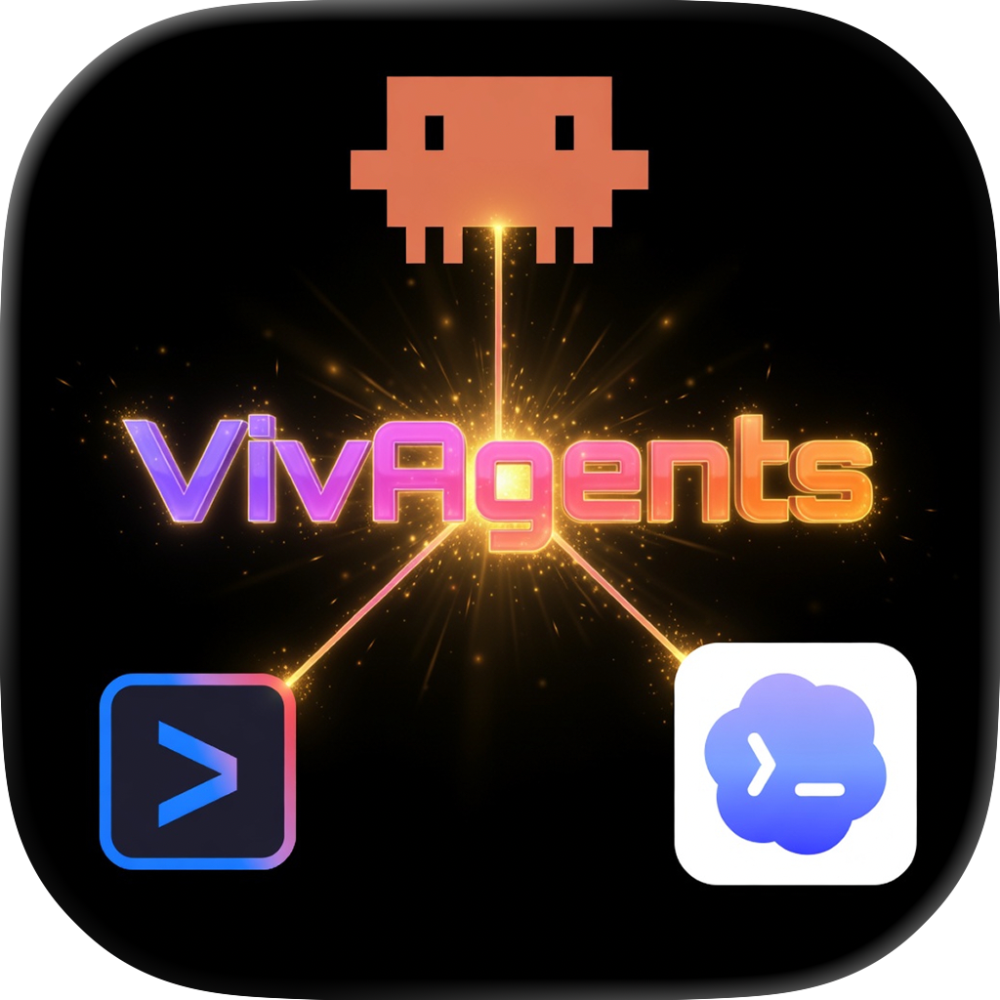

<p align="center">
  
</p>

<h1 align="center">VivAgents</h1>

<p align="center">
  <strong>Standalone CLI Agents server — wraps Claude, Codex, and Gemini CLIs behind a simple HTTP API</strong>
</p>

<p align="center">
  <a href="https://www.npmjs.com/package/vivagents"></a>
  
  
  <a href="https://github.com/n0an/vivagents/blob/main/LICENSE"></a>
  <a href="https://github.com/n0an/vivagents/stargazers"></a>
</p>

<p align="center">
  
  
  
</p>

---

Run it on your Mac, a Linux VPS, or anywhere Node.js runs — then connect your apps over the network for AI text processing without needing each device to have CLI tools installed.

Built primarily as a companion server for [VivaDicta](https://vivadicta.com) (iOS/macOS speech-to-text app with AI processing), but the API is simple and generic — any app, script, or automation can use it to send text and get AI-processed results back over HTTP.

> **Disclaimer:** Claude Code, Codex CLI, and Gemini CLI are designed and licensed for software development use. Using them for general text processing may fall outside the intended use of their respective providers and could lead to account restrictions. By using VivAgents you acknowledge this and proceed at your own risk. VivAgents is not affiliated with Anthropic, OpenAI, or Google. For unrestricted usage, consider using direct API keys from each provider instead.

## How It Works

VivAgents discovers installed CLI tools on the host machine, starts an HTTP server, and proxies text processing requests to the appropriate CLI:

```
Your App ──► VivAgents Server ──► Claude / Codex / Gemini CLI
  (iOS)        (Mac or VPS)         (spawns process, returns result)
```

- **No API keys needed** — uses your existing CLI subscriptions (Claude Pro/Max, ChatGPT Plus, Google account)
- **Three providers** — Claude Code (Anthropic), Codex CLI (OpenAI), Gemini CLI (Google)
- **Auto-discovery** — finds CLI binaries via PATH, nvm, and common install locations
- **Bearer token auth** — auto-generated, stored in `~/.vivagents/token`
- **Stateless** — each request is independent, no conversation history or sessions
- **Zero external dependencies** — just Node.js standard library

**Beyond VivaDicta**, you can use VivAgents for any text processing workflow — shell scripts, iOS Shortcuts, Automator actions, or any app that can make HTTP requests. If you already pay for a CLI subscription, VivAgents turns it into a network-accessible AI API.

> **Note:** VivAgents is designed for single request-response text processing (grammar correction, rewriting, summarization, translation, etc.) — not for interactive chat. There are no sessions, no conversation memory, no streaming, and no OpenAI-compatible API format. Each request is standalone: you send text in, you get processed text back. If you need a conversational AI proxy or an OpenAI-compatible gateway, check out projects like [CLIProxyAPI](https://github.com/router-for-me/CLIProxyAPI) or [AgentAPI](https://github.com/coder/agentapi).

## Prerequisites

Install and authenticate at least one CLI tool:

| CLI | Install | Authenticate |
|-----|---------|-------------|
| [Claude Code](https://code.claude.com/docs/en/quickstart) | `curl -fsSL https://claude.ai/install.sh \| bash` | Run `claude` and sign in with your Anthropic account |
| [Codex CLI](https://github.com/openai/codex) | `npm install -g @openai/codex` or `brew install codex` | Run `codex` and select "Sign in with ChatGPT" |
| [Gemini CLI](https://github.com/google-gemini/gemini-cli) | `npm install -g @google/gemini-cli` or `brew install gemini-cli` | Run `gemini` and select "Sign in with Google" |

Requires **Node.js 20+** (for Codex and Gemini CLIs). Claude Code installs standalone with no dependencies.

## Quick Start

### Option A: npm (recommended)

```bash
npx vivagents check    # Check which CLIs are available
npx vivagents start    # Start the server
```

Or install globally:

```bash
npm install -g vivagents
vivagents start
```

### Option B: from source

```bash
git clone https://github.com/n0an/vivagents.git
cd vivagents
npm install
npm run build
node dist/index.js start
```

The server starts on port `3456` by default. An auth token is auto-generated on first run and stored in `~/.vivagents/token`. Use `vivagents token` to view it.

```
2026-03-28T10:38:42.619Z [INFO]  VivAgents server running on http://0.0.0.0:3456
2026-03-28T10:38:42.619Z [INFO]  Auth token: an0mVfYI...
2026-03-28T10:38:42.619Z [INFO]    ✓ Claude CLI (/Users/you/.local/bin/claude)
2026-03-28T10:38:42.619Z [INFO]    ✓ Codex CLI (/Users/you/.nvm/versions/node/v23.11.1/bin/codex)
2026-03-28T10:38:42.619Z [INFO]    ✓ Gemini CLI (/Users/you/.nvm/versions/node/v23.11.1/bin/gemini)
```

## CLI Commands

```bash
vivagents start              # Start the server (default)
vivagents check              # Show which CLIs are available
vivagents doctor             # Diagnose issues (binary, auth, port, config)
vivagents token              # Print the current auth token
vivagents token --reset      # Generate a new auth token
vivagents help               # Show help
```

### Options

```bash
vivagents start --port 8080          # Custom port
vivagents start --host 127.0.0.1    # Bind to localhost only
vivagents start --token mysecret     # Use a specific auth token
vivagents start --claude-path /path  # Custom CLI binary path
```

## API

All endpoints require an `Authorization: Bearer <token>` header (or a `"token"` field in the JSON body).

### `GET /health`

Check server status and provider availability.

```bash
curl -H "Authorization: Bearer $TOKEN" http://localhost:3456/health
```

```json
{
  "status": "ok",
  "claude_available": true,
  "claude_path": "/Users/you/.local/bin/claude",
  "codex_available": true,
  "codex_path": "/Users/you/.nvm/versions/node/v23.11.1/bin/codex",
  "gemini_available": true,
  "gemini_path": "/Users/you/.nvm/versions/node/v23.11.1/bin/gemini",
  "version": "1.0.0"
}
```

### `GET /models`

List available models for each provider.

```bash
curl -H "Authorization: Bearer $TOKEN" http://localhost:3456/models
```

```json
{
  "models": ["claude-sonnet-4-6", "claude-opus-4-6", "claude-haiku-4-5"],
  "default": "claude-sonnet-4-6",
  "codex_models": ["gpt-5.4", "gpt-5.4-mini", "gpt-5.2", "gpt-5.1"],
  "codex_default": "gpt-5.4",
  "gemini_models": ["gemini-2.5-pro", "gemini-2.5-flash", "gemini-2.5-flash-lite"],
  "gemini_default": "gemini-2.5-flash"
}
```

### `POST /process`

Process text through a CLI provider.

```bash
curl -X POST -H "Authorization: Bearer $TOKEN" \
  -H "Content-Type: application/json" \
  -d '{
    "text": "hello wrold how are yuo",
    "systemPrompt": "Fix grammar and spelling. Return only the corrected text.",
    "provider": "gemini",
    "model": "gemini-2.5-flash"
  }' \
  http://localhost:3456/process
```

```json
{
  "result": "Hello world, how are you?",
  "model": "gemini-2.5-flash",
  "provider": "gemini",
  "duration": 3.45
}
```

**Parameters:**

| Field | Type | Required | Description |
|-------|------|----------|-------------|
| `text` | string | Yes | Text to process |
| `systemPrompt` | string | No | Instructions for the AI |
| `provider` | string | No | `"claude"` (default), `"codex"`, or `"gemini"` |
| `model` | string | No | Model to use (defaults to provider's default) |

### Error Codes

| Code | HTTP Status | Meaning |
|------|-------------|---------|
| `UNAUTHORIZED` | 403 | Invalid or missing auth token |
| `INVALID_REQUEST` | 400 | Bad JSON or missing required fields |
| `BINARY_NOT_FOUND` | 500 | CLI tool not installed |
| `NOT_AUTHENTICATED` | 401 | CLI tool not logged in |
| `RATE_LIMITED` | 429 | Provider rate limit reached |
| `EMPTY_RESPONSE` | 500 | CLI returned no output |
| `EXECUTION_FAILED` | 500 | CLI process error |

## Configuration

Configuration is loaded with cascading priority: **CLI args > env vars > config file > defaults**.

### Config File

Create `~/.vivagents/config.json` (or `vivagents.config.json` in the working directory):

```json
{
  "port": 3456,
  "host": "0.0.0.0",
  "timeout": 90000,
  "logLevel": "info",
  "providers": {
    "claude": {
      "enabled": true,
      "path": null,
      "models": ["claude-sonnet-4-6", "claude-opus-4-6", "claude-haiku-4-5"],
      "defaultModel": "claude-sonnet-4-6"
    },
    "codex": {
      "enabled": true,
      "path": null,
      "models": ["gpt-5.4", "gpt-5.4-mini", "gpt-5.2", "gpt-5.1"],
      "defaultModel": "gpt-5.4"
    },
    "gemini": {
      "enabled": true,
      "path": null,
      "models": ["gemini-2.5-pro", "gemini-2.5-flash", "gemini-2.5-flash-lite"],
      "defaultModel": "gemini-2.5-flash"
    }
  }
}
```

Set `"path"` to override auto-detection for a specific CLI. Set `"enabled": false` to disable a provider.

**Example: only allow Claude, disable Codex and Gemini:**

```json
{
  "providers": {
    "claude": { "enabled": true },
    "codex": { "enabled": false },
    "gemini": { "enabled": false }
  }
}
```

Disabled providers won't appear in `/health` or `/models` responses, and `/process` requests to them will return an error. You only need to include the fields you want to change — defaults apply for everything else.

> **Note on model lists:** The default model lists are derived empirically — they include models confirmed to work with each CLI tool at the time of release. CLI providers may support additional models not listed here. You can customize the model list per provider in the config file.

### Environment Variables

```bash
VIVAGENTS_PORT=3456
VIVAGENTS_HOST=0.0.0.0
VIVAGENTS_TOKEN=your-secret-token
VIVAGENTS_TIMEOUT=90000
VIVAGENTS_LOG_LEVEL=info        # debug, info, warn, error
VIVAGENTS_CLAUDE_PATH=/path/to/claude
VIVAGENTS_CODEX_PATH=/path/to/codex
VIVAGENTS_GEMINI_PATH=/path/to/gemini
```

## Deployment

### Run with PM2 (recommended for always-on)

```bash
npm install -g vivagents pm2
pm2 start vivagents -- start
pm2 save
pm2 startup    # Auto-start on boot
```

### Run as systemd service (Linux)

First install globally: `npm install -g vivagents`, then find the path: `which vivagents`.

Create `/etc/systemd/system/vivagents.service`:

```ini
[Unit]
Description=VivAgents CLI Server
After=network.target

[Service]
Type=simple
User=your-user
ExecStart=/path/from/which/vivagents start
Restart=always
RestartSec=5
Environment=PATH=/usr/local/bin:/usr/bin:/your/node/bin

[Install]
WantedBy=multi-user.target
```

```bash
sudo systemctl enable vivagents
sudo systemctl start vivagents
```

### Security

> **Warning:** VivAgents serves plain HTTP with no TLS. **Do not expose it directly to the public internet.** Your auth token and all request/response data will be transmitted in plaintext and can be intercepted. Use one of these approaches for secure remote access:
>
> - **Tailscale** (recommended) — encrypted private network, no public exposure
> - **Reverse proxy** (Caddy, nginx) — terminate TLS in front of VivAgents
> - **SSH tunnel** — `ssh -L 3456:localhost:3456 user@vps`
>
> For local-only use (same machine), bind to localhost: `vivagents start --host 127.0.0.1`

### Secure access with Tailscale

For VPS deployments, [Tailscale](https://tailscale.com) provides encrypted private networking without exposing the server to the public internet:

```bash
# On VPS
tailscale up
vivagents start    # Binds to 0.0.0.0:3456

# From your phone/laptop (within tailnet)
curl http://<tailscale-ip>:3456/health
```

### Public access with HTTPS

If you need to expose VivAgents on a public IP, put it behind a reverse proxy with TLS. [Caddy](https://caddyserver.com) is the easiest option — it auto-provisions HTTPS certificates via Let's Encrypt:

1. Install Caddy: `sudo apt install caddy`
2. Edit `/etc/caddy/Caddyfile`:

```
vivagents.yourdomain.com {
    reverse_proxy localhost:3456
}
```

3. Bind VivAgents to localhost only:

```bash
vivagents start --host 127.0.0.1
```

4. Restart Caddy: `sudo systemctl restart caddy`

Caddy handles TLS on port 443, forwards to VivAgents on localhost:3456. Your auth token is transmitted encrypted. Point your DNS A record to your server's public IP.

### CLI authentication on a headless server

CLI tools require browser-based authentication on first use. On a headless VPS:

1. **SSH with port forwarding:** `ssh -L 8080:localhost:8080 user@vps`, then run the CLI auth flow — it will open the callback URL on your local machine.
2. **Or authenticate locally first**, then copy the credential directories to the server:
   - Claude: `~/.claude/`
   - Codex: `~/.codex/`
   - Gemini: `~/.config/gemini/` (or `~/.gemini/`)

## Project Structure

```
vivagents/
├── src/
│   ├── index.ts              # Entry point, CLI commands
│   ├── server.ts             # HTTP server, routing, auth
│   ├── config.ts             # Config loading (file + env + args)
│   ├── logger.ts             # Structured logging
│   ├── providers/
│   │   ├── types.ts          # CLIProvider interface
│   │   ├── discovery.ts      # Binary auto-discovery
│   │   ├── claude.ts         # Claude Code provider
│   │   ├── codex.ts          # Codex CLI provider
│   │   └── gemini.ts         # Gemini CLI provider
│   ├── routes/
│   │   ├── health.ts         # GET /health
│   │   ├── models.ts         # GET /models
│   │   └── enhance.ts        # POST /process handler
│   └── utils/
│       ├── process.ts        # Child process spawning
│       └── error-detection.ts
├── bin/vivagents.js           # CLI entry point
├── package.json
└── tsconfig.json
```

## Contributing

Contributions are welcome! Feel free to open issues and pull requests.

```bash
git clone https://github.com/n0an/vivagents.git
cd vivagents
npm install
npm run build
node dist/index.js check
```

If you'd like to add support for a new CLI provider, look at `src/providers/claude.ts` as a reference — each provider implements the `CLIProvider` interface.

## License

MIT
